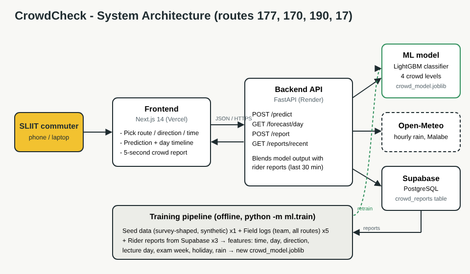

# CrowdCheck - AI Bus Crowd Prediction

Predicts how crowded a bus on the SLIIT Malabe corridor will be before a student leaves, and lets riders submit a 5-second crowd report after their trip.

## Routes covered
| Route | Ends | `direction` values |
|---|---|---|
| 177 | Kollupitiya - Kaduwela | `to_kaduwela`, `to_kollupitiya` |
| 170 | Athurugiriya - Pettah | `to_athurugiriya`, `to_pettah` |
| 190 | Meegoda - Pettah | `to_meegoda`, `to_pettah` |
| 17 | Panadura - Kandy | `to_kandy`, `to_panadura` |

Pick the route with the buttons at the top of the app. The old 177 names `to_sliit` / `from_sliit` still work in the API and are mapped to `to_kaduwela` / `to_kollupitiya`.

### Crowd pattern
Morning rush goes **into Colombo**, evening rush goes **out of Colombo**: 177 is packed towards Kollupitiya in the morning and towards Kaduwela in the evening; 170/190 towards Pettah in the morning; 17 towards Panadura (Colombo suburbs) in the morning and towards Kandy in the evening. Each route's Colombo-bound direction is set by `to_colombo` in `backend/ml/features.py`.

### Holidays (Poya + public)
- Dates come from Google's **Holidays in Sri Lanka** calendar using `GOOGLE_API_KEY` (Calendar API key, no billing needed), saved to `backend/data/holidays_lk.json`.
- The repo ships that file pre-filled with the official 2026 list, so everything works without a key.
- The API refreshes it from Google on startup and once a day. Refresh by hand: `python -m ml.holidays` (list it: `python -m ml.holidays --list`).
- Model features: `is_public_holiday`, `is_poya`, `is_long_weekend`, `is_day_before_holiday`, `is_day_after_holiday`.
- Effects in the seed data: city routes much quieter on holidays; 17 busier on Poya and long weekends (towards Kandy); heavier evening rush out of Colombo the day before a holiday; heavier morning rush into Colombo the day after.
- `/predict` returns a `day` object with the holiday name and a short note; `GET /holidays?days=60` lists upcoming holidays.
- SLIIT exam weeks are not in Google's calendar. Edit `EXAM_WEEKS` in `backend/ml/features.py`.

To add a route: add it to `ROUTES` in `backend/ml/features.py`, add a crowd profile in `backend/ml/generate_seed_data.py`, add it to `frontend/lib/routes.ts`, then regenerate seed data and retrain.



## Stack
- **Frontend:** Next.js 14 (TypeScript), deployed on Vercel
- **Backend:** FastAPI (Python 3.11), deployed on Render
- **Model:** LightGBM multiclass classifier (Seats free / Standing room / Packed / Can't board)
- **Database:** Supabase PostgreSQL (`crowd_reports`), SQLite fallback for local dev
- **Weather:** Open-Meteo hourly rain for Malabe (no API key)

## Folder structure
```
backend/
  app/main.py              API endpoints
  app/db.py                Database (Supabase or local SQLite)
  ml/features.py           Shared features + calendar config (holidays, exam weeks)
  ml/generate_seed_data.py Synthetic seed data (survey-shaped)
  ml/train.py              Trains and saves the model
  data/field_logs.csv      Real observations the team logs (see FIELD_LOG_GUIDE.md)
  models/                  crowd_model.joblib + metrics.json
frontend/                  Next.js app
supabase/schema.sql        Table setup
docs/                      Architecture diagram, Gate 2 answer draft, demo script
```

## Run locally

### 1. Backend
```bash
cd backend
python -m venv .venv
# Windows: .venv\Scripts\activate    Mac/Linux: source .venv/bin/activate
pip install -r requirements.txt
python -m ml.generate_seed_data
python -m ml.train
uvicorn app.main:app --reload --port 8000
```
Open http://localhost:8000/docs to try the API. Without `DATABASE_URL` it uses a local `local.db` SQLite file.

### 2. Frontend
```bash
cd frontend
cp .env.example .env.local    # NEXT_PUBLIC_API_URL=http://localhost:8000
npm install
npm run dev
```
Open http://localhost:3000

## API
| Method | Path | What it does |
|---|---|---|
| POST | `/predict` | `{direction, time, date?}` returns crowd level, confidence, tip, better nearby bus |
| GET | `/forecast/day?route=17&direction=to_kandy&date=YYYY-MM-DD` | Predicted level for every 10-min departure |
| POST | `/report` | `{direction, crowd_level 0-3, stop_name?}` saves a rider report |
| GET | `/reports/recent` | Reports from the last few hours |
| GET | `/holidays?days=60` | Upcoming Poya and public holidays the model uses |
| GET | `/model-info` | Training metrics + number of reports collected |
| GET | `/health` | Health check |

Every endpoint takes `route` (`177`, `170`, `190`, `17`; default `177`). Valid `direction` values per route are in the table at the top.

## Deploy

### Supabase
1. Create a project, open **SQL Editor**, run `supabase/schema.sql`.
2. **Project Settings > Database > Connection string > URI**. Use the pooler string (port 6543) and put your DB password in it.

### Backend on Render
1. New > Blueprint > select this repo (uses `render.yaml`), or New > Web Service with root dir `backend`.
2. Build: `pip install -r requirements.txt && python -m ml.holidays && python -m ml.generate_seed_data && python -m ml.train`
3. Start: `uvicorn app.main:app --host 0.0.0.0 --port $PORT`
4. Env vars: `DATABASE_URL` (Supabase URI), `FRONTEND_ORIGIN` (your Vercel URL), `GOOGLE_API_KEY` (holidays).

Free Render instances sleep after inactivity. Open the API URL once before recording the demo so it's awake.

### Frontend on Vercel
1. Import the repo, set **Root Directory** to `frontend`.
2. Env var: `NEXT_PUBLIC_API_URL=https://your-api.onrender.com`
3. Deploy, then add the Vercel URL to `FRONTEND_ORIGIN` on Render.

## Improving the model
1. Log real buses in `backend/data/field_logs.csv` (guide: `backend/data/FIELD_LOG_GUIDE.md`).
2. Update holidays and exam weeks in `backend/ml/features.py`.
3. Retrain: `python -m ml.train --with-reports` (includes rider reports from the database).

Training weights: synthetic seed x1, rider reports x3, field logs x5.

## Honest note on data
There is no public ridership data for these routes, so the model is trained on **synthetic seed data shaped by our survey** (50 SLIIT commuters, 20-23 Sept 2026). The hold-out accuracy in `models/metrics.json` measures fit to that seed pattern, not real-world accuracy. Routes 170 and 190 had only 4 survey ratings each, so their seed shape is a rough estimate. Real field logs and rider reports replace the seed data over time.

## Team
Siriwardhana P.K.S.M (IT25101412), Prabaswara T.H.U. (IT25101712), Nethwin S.W.S (IT25102242), Priyabashitha G.J.S (IT25101700)
